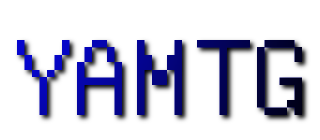

# yamtg




> Yet another Minetest game.

## Install

```
$ git clone https://github.com/schas002/yamtg.git /path/to/minetest/games/yamtg
```

## Usage

Click the  icon in the singleplayer menu.

## Maintainer

- Andrew Zyabin - @schas002 - [@zyabin101@botsin.space](https://botsin.space/@zyabin101)

## Contribute

Of course! Every issue and PR is welcome.

Every contributor to this repository must follow the code of conduct, which is: don't be rude.

## License

[MIT / CC-BY 4.0](LICENSE) &copy; Andrew Zyabin

Parts of [Minetest Game](https://github.com/minetest/minetest_game) are used, which are licensed under various licenses. All licenses are mentioned in LICENSE files, where required.